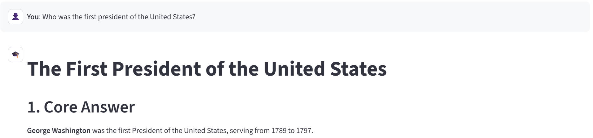
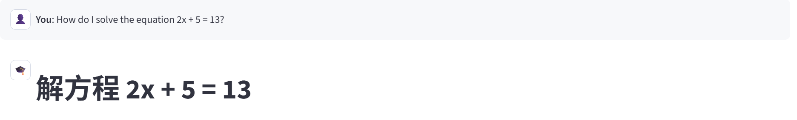
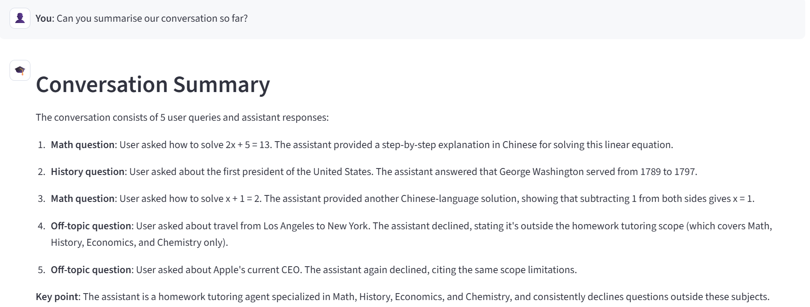
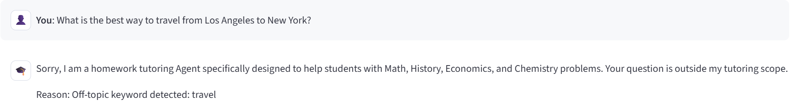
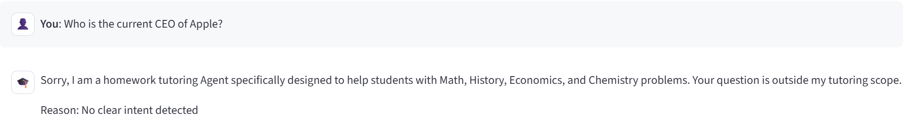

# SmartTutor Report

## 1. Overview

SmartTutor is a homework tutoring agent built for first-year university students. The system focuses on four supported subjects: **Math, History, Economics, and Chemistry**. Its main goal is not only to answer academic questions, but also to **reliably reject invalid requests** such as off-topic, dangerous, or unverifiable local questions. In addition, the agent supports a **conversation summary** request so that a user can review the discussion so far.

The implementation follows a lightweight multi-stage pipeline:

`User Input -> Input Validation -> Quick Keyword Check -> LLM Intent Classification -> Subject Routing / Rejection -> Streamed Response`

This design was chosen because the assignment emphasizes both usability and reliability. The keyword layer gives a fast first-pass filter for obviously unsafe or irrelevant requests, while the LLM classifier provides a more flexible final routing decision. Once a request is accepted, SmartTutor forwards it to a subject-specific agent with prompts adapted to the selected student level.

## 2. Agent Design

The system is implemented in Streamlit and organized into several modules:

- `app.py`: the main web application. It manages the chat interface, session history, sidebar settings, and response streaming.
- `guardrails.py`: the core safety and routing module. It validates input length, checks dangerous/off-topic/obscure keywords, detects summary requests, and uses the LLM for final intent classification.
- `math_agent.py`, `history_agent.py`, `economics_agent.py`, `chemistry_agent.py`: subject-specific tutoring agents. Each agent uses a dedicated system prompt to produce explanations appropriate for homework help.
- `llm_utils.py`: a wrapper around the LLM API. It supports multiple backends and streams model output to the user interface.

The most important design decision is the **guardrails-first architecture**. Instead of sending every request directly to a general-purpose model, SmartTutor first decides whether the question should be accepted at all. This reduces irrelevant responses and makes the system closer to a real educational assistant rather than a generic chatbot. The interface also allows the user to choose the API source and grade level, which changes the explanation style.

## 3. Running Instructions

From the project root:

```bash
cd code
pip install -r requirements.txt
streamlit run app.py
```

If `requirements.txt` is not used, the essential packages are:

```bash
pip install streamlit openai
```

After launching Streamlit, open the local URL shown in the terminal, choose an API source in the sidebar, and then ask a homework question. The agent accepts supported academic questions, rejects invalid ones, and also accepts requests such as `Can you summarise our conversation so far?`

## 4. Example Interactions

The following screenshots are taken from the implemented system and match the assignment requirement of including accepted questions, rejected questions, and a summary request.

### Example 1: Accepted history question

User question: **Who was the first president of the United States?**

This is accepted as a valid history question. The agent routes it to the history tutor and gives a direct factual answer with context.



### Example 2: Accepted math question

User question: **How do I solve the equation 2x + 5 = 13?**

This is accepted as a valid math homework problem. The math agent provides a worked solution.



### Example 3: Accepted summary request

User request: **Can you summarise our conversation so far?**

This is accepted because summary requests are explicitly supported by the guardrails module. The agent summarizes both accepted and rejected turns in the conversation history.



### Example 4: Rejected off-topic question

User question: **What is the best way to travel from Los Angeles to New York?**

This request is rejected because it is outside the homework domain. The guardrails detect the off-topic keyword `travel` and return a refusal message.



### Example 5: Rejected unsupported general question

User question: **Who is the current CEO of Apple?**

This request is also rejected. It is not a homework question in one of the supported subjects, so the system refuses it rather than acting as a general knowledge assistant.



### Example 6: Additional accepted math interaction

The summary screenshot shows another accepted math question in the same session: **How do I solve x + 1 = 2?** This demonstrates that the system supports multi-turn homework tutoring and can later summarize the whole dialogue.

## 5. Discussion

Overall, SmartTutor satisfies the assignment goal of building a focused academic agent with clear boundaries. Its strengths are:

- support for multiple academic subjects rather than only one domain;
- a practical guardrails mechanism that rejects invalid inputs early;
- conversation memory and summary support;
- a simple Streamlit interface that is easy to demonstrate.

The current system is intentionally narrow in scope: it prioritizes reliable homework support over open-ended general chat. That tradeoff is appropriate for this course project, because it makes the agent easier to control, evaluate, and explain.
